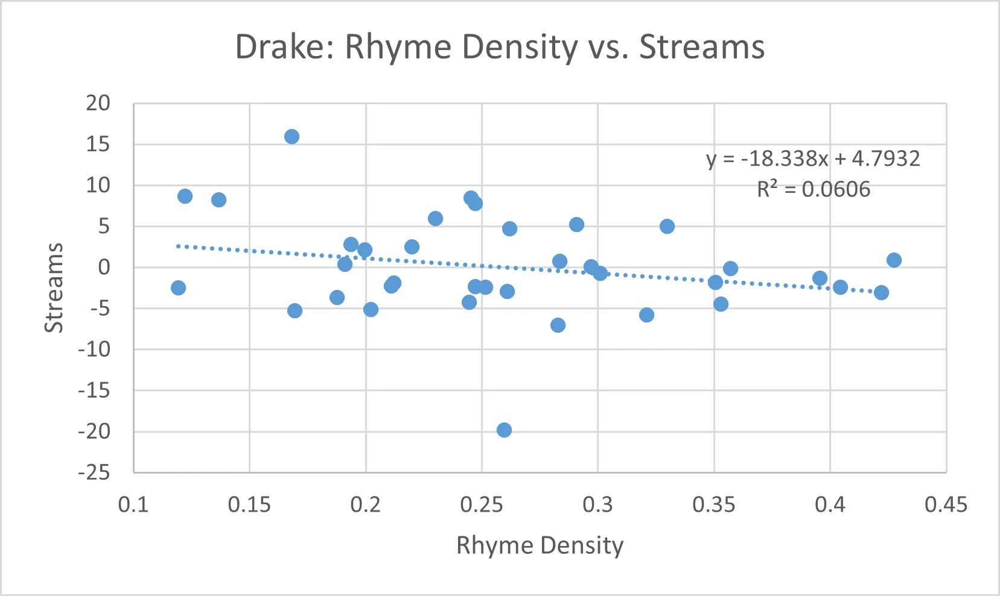
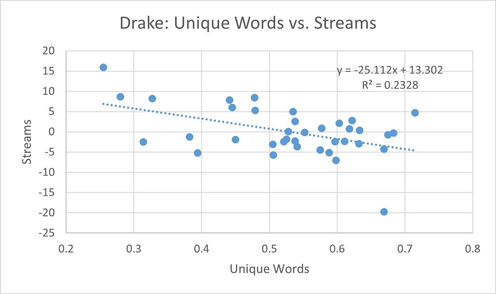
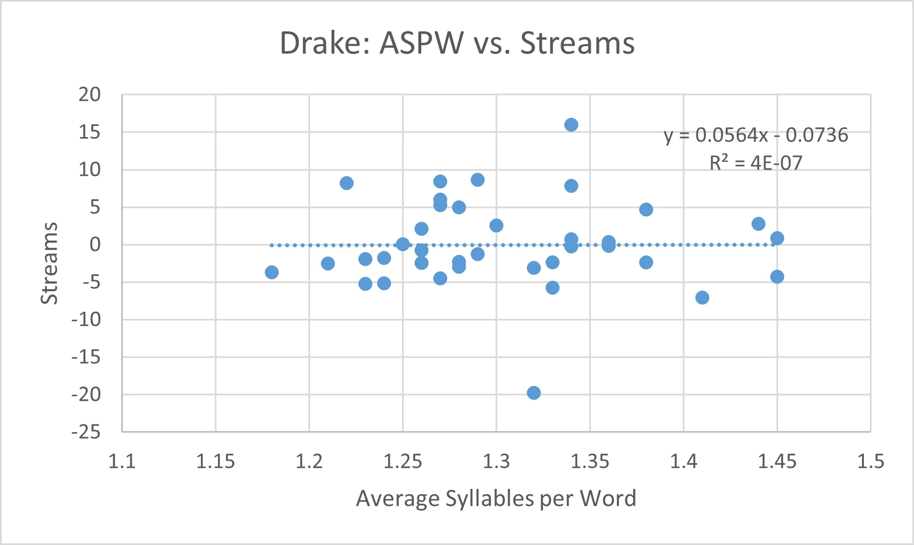
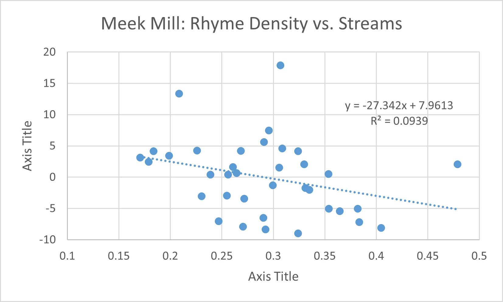
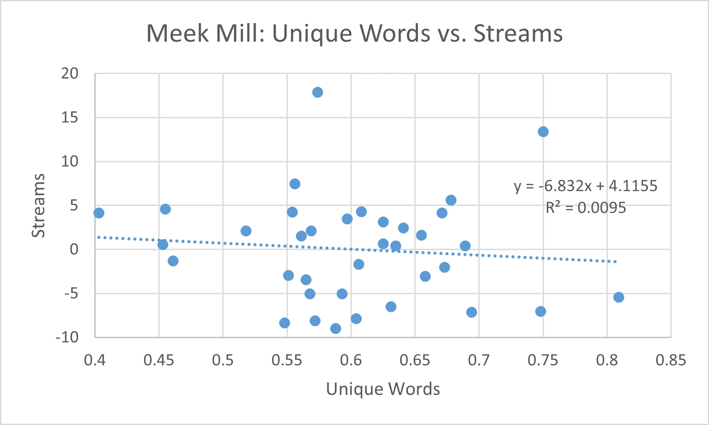
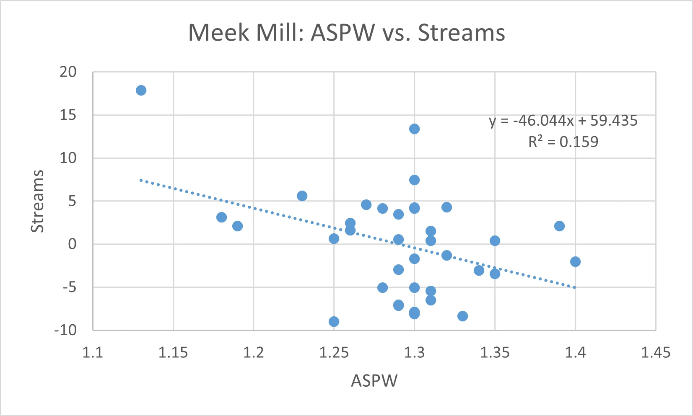

# Drake vs. Meek Mill - By the Numbers

Hello, and welcome to my first official blog post! With all the hubbub around the Kendrick Lamar vs. Drake beef that dominated last summer and this year’s Super Bowl halftime show, I wanted to take a look back at another pivotal rap feud— Drake vs. Meek Mill. Nearly a decade ago, this rivalry ignited major conversations about ghostwriting in hip-hop and questioned Drake’s credibility in the industry with many even seeing it as a precursor to today’s beef.

Historically, there wasn't much data-driven analysis of hip-hop music and artists other than basic stats like CD sales and grammy nominations (s/o to [Hip Hop By The Numbers](https://x.com/HipHopNumbers) for later expanding the space). At the time of writing, I was captivated by a [study by Matt Daniels](https://pudding.cool/2017/02/vocabulary/) doing rounds on the internet which examined the vocabulary size of rappers (the nascent days of natural language processing). Since I was taking a statistics class at the time and needed a project, I thought it'd be fun to try out something similar. Below is the original version of the submitted assignment (written October 23, 2015). I'd take the analysis with a grain of salt (I think I only got an A- 😂). Maybe one day I'll repurpose it for a larger audience in a less cringy manner. Nonetheless, a lot of my friends enjoyed the read (even those that weren't technically minded), and I hope you do too!

## Statistical Analysis

Over the past summer, the internet exploded as a beef (grievance) grew between rappers Drake and Meek Mill. What started as a controversial tweet grew into the top trending topic on social media for a week. During this time several comparisons were made between the two entertainers. Although many feel strongly that one of them emerged victorious, these sentiments are inherently based on subjective opinions. I hoped to find some sort of quantifiable, objective comparison between the two in order to properly frame the discussion. Thus, I present my comparative statistical analysis of Drake and Meek Mill.

My first task was to decide what metric to compare the artists on. The obvious choice is album sales or streams. However, within the hip-hop community, it is generally considered that the money earned by an artist is not necessarily an indicator of quality. Hip-hop artist Immortal Technique expresses this sentiment by saying, "If you go platinum, it's got nothing to do with luck/ It just means that a million people are stupid as f***." Thus, to truly get a sense of an artist's quality within a hip-hop context, we must look to their lyrics.

Ignoring whether or not the allegations that Drake uses a ghostwriter are true, we want to compare the lyrical output or end product that the two rappers release. Thanks to advancements in language processing, several new metrics have been developed in recent years to obtain quantitative information on song lyrics. Here are some metrics that will be used in the analysis:

- Rhyme Density – (number of syllables a part of rhyme) / (total number of syllables)
- Unique Words – (number of words not repeated) / (total number of words)
- Average Syllables per Word – (total number of syllables) / (total number of words)

The data was collected by choosing 36 songs from each rapper's discography (primarily from the most recent two to three solo projects) and inputting their lyrics (from RapGenius) into RapPad's online Blueprint tool (found at [www.rappad.co](https://www.rappad.co)). Lyrics from featured artists and duplicate lyrics (such as hooks) were omitted. The processing engine at RapPad then calculated the desired metrics and provided a variety of statistics. The output is usually not 100% accurate, especially with respect to rhyming syllables. However, given the large sample size used and comparative nature of the analysis, the resulting metrics were deemed acceptable for this study.

The first metric we will examine is rhyme density. Rhyme density gives us a sense of how technically skilled or "efficient" a rapper is with words. Generally, a rapper with a higher rhyme density is seen as more proficient in his or her craft. To give a sense of the numbers, Big Pun, seen as one of the most technically skilled hip-hop artists, averages a rhyme density of 0.4, while a low rhyme density is around 0.2. Selecting one song from each rapper, a sample in this case is defined as the numerical difference between those two songs' rhyme densities. To set up this two-sided hypothesis test, we have the following:
$$
X = (\text{rhyme density of Drake song}) - (\text{rhyme density of Meek Mill song})
$$
$$
H_0: \mu = 0, \quad H_1: \mu \neq 0
$$

Using the data generated (presented in the Appendix), we have the following statistics:
$$
n = 36, \quad \bar{X} = -0.03019, \quad S = 0.1246
$$
Since the sample size is large, we will assume that the sample standard deviation is approximately equivalent to the population standard deviation (𝑆 ≈ 𝜎). A Z-statistic is used to calculate the p-value. We will also use an α of 0.05.
$$
Z = \frac{\bar{X} - \mu}{\sigma / \sqrt{n}}, \quad
\text{Confidence interval} = \left(\bar{X} - z_{\alpha/2} \cdot \frac{\sigma}{\sqrt{n}}, \quad \bar{X} + z_{\alpha/2} \cdot \frac{\sigma}{\sqrt{n}}\right)
$$
Thus, we arrive at a 95% confidence interval for the average mean difference in rhyme density as (−0.07089, 0.01051). We also arrive at a z-score of -1.454. Given that $z_{\alpha/2}$ = -1.96, it is evident that $|z| < |z_{\alpha/2}|$. Thus, here we do not have enough evidence to reject the null hypothesis.

The next metric for comparison is unique words. Unique words gives us an idea of how repetitive an artist is or their breadth of vocabulary within a song. This ignores duplicated sections of the song (such as a chorus repeated several times) in order to give a fair comparison of the songs. Within hip-hop, a lower unique words score generally detracts from a rapper's technical skills. However, within pop music, a lower unique words score may be preferred. Performing another hypothesis test similar to before (same null and alternative hypotheses) with the difference in unique words as a sample, the resulting statistics are:
$$
n = 36, \quad \bar{X} = -0.07694, \quad S = 0.1556
$$
Continuing with the same assumptions, we now have a 95% confidence interval as (-0.1278, -0.0261) and a z-score of -2.97. In this case, $|z| > |z_{\alpha/2}|$. We therefore have enough evidence to reject the null hypothesis.

The final metric for comparison is average syllables per word (ASPW). This gives us a sense of their vocabulary and technical skill (ex. Rhyming 'cat' with 'bat' instead of 'prophecy' with 'philosophy'). Values typically range from 1 to 1.5. Again, higher ASPW scores suggest that a rapper is more technically skilled. Continuing with the same hypothesis testing process and assumptions,
$$
n = 36, \quad \bar{X} = 0.01278, \quad S = 0.07984
$$
The 95% confidence interval is now (-0.0133, 0.03886), and the z-score is 0.9602. As $|z| < |z_{\alpha/2}|$, we do not have enough evidence to reject the null hypothesis.

So far, we learned that there is not sufficient evidence to reject the claim that there is no difference between the rappers' rhyme densities or the claim that there is no difference between the rappers' ASPW. However, there is sufficient evidence to reject the claim that there is no difference between the rappers' unique word scores in favor of Meek Mill.

| Song | Rhyme Density | Unique Words | ASPW |
|------|---------------|--------------|------|
| R.I.C.O. (Drake) | 0.2671 | 0.683 | 1.34 |
| R.I.C.O. (Meek Mill) | 0.2085 | 0.75 | 1.3 |
| Back 2 Back | 0.2971 | 0.528 | 1.25 |
| Wanna Know | 0.3097 | 0.519 | 1.31 |

To further this comparison, let's look at the song "R.I.C.O." in which both artists are featured (data above). When collaborating on this song, the two rappers had similar metrics which were also similar to their average scores. During the actual beef, Drake and Meek Mill respectively released the diss tracks "Back 2 Back" and "Wanna Know." Interestingly here, they both stepped up with higher than average rhyme densities, but they had lower than average unique words score. Meek Mill performed noticeably better compared to Drake on ASPW, but not by a significant amount. Although this is one data point, it is in favor of the statement that the rappers displayed more technical rhyming skills on the diss tracks to be competitive, yet repeated more words, perhaps in an effort to be catchier. Unfortunately, there are not enough data to support this with tests.

This study begs the question if the analysis conducted is even justified. The quantifiable metrics presented tend towards measuring technical skill. However, one could argue that technical skill is not always the highest aim of a rapper. Personally, I believe that if you can fall under the category of "rapper," then you cannot shy away from these metrics. On the other hand, these results do not state anything about whether being technical is ultimately a good thing. To further this discussion of justification, I have attempted to set up a quantitative metric to determine how justified these metrics are for each rapper. To simplify this analysis, I am assuming the following: 1) the above metrics are more suited for hip-hop songs than pop songs, 2) pop songs are more popular (by sales/streams) than hip-hop songs, and 3) songs that display lower technical ability are to be considered more pop than hip-hop. Since we are shifting the context of the discussion to beyond hip-hop, we can now use the streaming data previously discounted. All streaming data were gathered from Spotify on October 17, 2015.

<!-- 2 x 3 -->

The above six graphs plot the previously used metrics against streams for each rapper. Since the streaming data is positively skewed, a logarithmic transformation was applied to reduce the influence of higher outlying values (very popular singles). In addition, to account for the order of magnitude difference between Drake and Meek Mill's streams, the log of the streams were linearly transformed into scaled z-scores. To analyze these graphs, we look first at the r² values to determine the strength of the regression. Only two regression lines had a significant fit, Meek's ASPW and Drake's Unique Words. For those lines, we next look at the slope. The slope indicates the "payoff" associated with becoming more pop. In other words, it quantifies relatively how many more streams would one get for sacrificing a certain amount of technical skill. A higher slope magnitude indicates a higher opportunity cost of becoming technical and thus a tendency to utilize a pop style. Meek reducing his ASPW by 0.1 would roughly yield an increase of about 4.6 (in terms of z-score of log of streams). Using smaller words is consistent with his (more or less) trap style of rapping (Meek's version of going "pop"). Similarly, if Drake reduced his unique words score by 0.1, he would increase his streams by 2.5. Repeating words is consistent with his singing, hook-focused style of rapping (Drake's version of going "pop"). Thus, we see both would have a tendency to go towards a pop style, but in different fashions. Thus, with respect to question of whether the previous metrics are justified, the answer seems to be "for certain categories depending on the rapper." For both, it appears that rhyme density is fair game, and both perform about the same. However, the unique words metric is not very well justified for Drake as he has much to gain by performing less well in this category. The same is true with Meek Mill and his ASPW.

This study follows the assumptions inherent in my views of how to compare rappers. The reader, however, may work within a different set of assumptions and arrive at a completely different result. Regardless, this study is intended to introduce and analyze a set of objective frameworks with which to continue discussion on this topic.

## Appendix

### Meek Mill Songs

| Song | Rhyme Density | Unique Words | ASPW | Streams |
|------|---------------|--------------|------|---------|
| Lord Knows | 0.2684 | 0.554 | 1.3 | 9954940 |
| Classic | 0.256 | 0.689 | 1.35 | 5828541 |
| Jump out the Face | 0.2908 | 0.678 | 1.23 | 12079821 |
| All Eyes on You | 0.3067 | 0.574 | 1.13 | 66814151 |
| The Trillest | 0.2994 | 0.461 | 1.32 | 4601380 |
| R.I.C.O. | 0.2085 | 0.75 | 1.3 | 35648485 |
| I Got the Juice | 0.3536 | 0.453 | 1.29 | 5938261 |
| Ambitionz | 0.3349 | 0.673 | 1.4 | 4158196 |
| Pullin' Up | 0.1986 | 0.597 | 1.29 | 8930723 |
| Check | 0.1836 | 0.403 | 1.28 | 9842116 |
| Been That | 0.331 | 0.606 | 1.3 | 4345518 |
| Bad For You | 0.1707 | 0.625 | 1.18 | 8518873 |
| Stand Up | 0.3539 | 0.568 | 1.28 | 2723860 |
| Cold Hearted | 0.2717 | 0.565 | 1.35 | 3410280 |
| Dreams and Nightmares | 0.2957 | 0.556 | 1.3 | 15610853 |
| In God We Trust | 0.3818 | 0.593 | 1.3 | 2736118 |
| Young & Gettin' It | 0.2607 | 0.655 | 1.26 | 6934111 |
| Traumatized | 0.2548 | 0.551 | 1.29 | 3647946 |
| Believe It | 0.1789 | 0.641 | 1.26 | 7756343 |
| Maybach Curtains | 0.2469 | 0.748 | 1.29 | 2071381 |
| Amen | 0.226 | 0.608 | 1.32 | 10020688 |
| Young Kings | 0.3239 | 0.588 | 1.25 | 1575572 |
| Lay Up | 0.3644 | 0.809 | 1.31 | 2590232 |
| Tony Story Pt. 2 | 0.2923 | 0.548 | 1.33 | 1721750 |
| Who You're Around | 0.2706 | 0.604 | 1.3 | 1834182 |
| Polo & Shell Tops | 0.2643 | 0.625 | 1.25 | 6025874 |
| Rich & Famous | 0.2304 | 0.658 | 1.34 | 3603868 |
| Real N***** Come First | 0.4046 | 0.572 | 1.3 | 1784535 |
| Monster | 0.3298 | 0.569 | 1.39 | 7374446 |
| FYM | 0.4788 | 0.518 | 1.19 | 7374446 |
| I Don't Know | 0.2902 | 0.631 | 1.31 | 2222851 |
| Levels | 0.3087 | 0.455 | 1.27 | 10446089 |
| House Party | 0.3057 | 0.561 | 1.31 | 6834573 |
| Burn | 0.3239 | 0.671 | 1.3 | 9842306 |
| Off the Corner | 0.2389 | 0.635 | 1.31 | 5831439 |
| A1 Everything | 0.3834 | 0.694 | 1.29 | 2030627 |
| Wanna Know | 0.3097 | 0.519 | 1.31 | - |

### Drake Songs

| Song | Rhyme Density | Unique Words | ASPW | Streams |
|------|---------------|--------------|------|---------|
| Worst Behavior | 0.4273 | 0.577 | 1.45 | 40327718 |
| Legend | 0.23 | 0.445 | 1.27 | 70947519 |
| Hotline Bling | 0.1366 | 0.327 | 1.22 | 90448353 |
| Back 2 Back | 0.2971 | 0.528 | 1.25 | 37065606 |
| Right Hand | 0.1695 | 0.394 | 1.23 | 20612517 |
| Know Yourself | 0.2454 | 0.478 | 1.27 | 92843578 |
| Energy | 0.247 | 0.441 | 1.34 | 86716988 |
| Charged Up | 0.2597 | 0.669 | 1.32 | 4167688 |
| 10 Bands | 0.3297 | 0.535 | 1.28 | 63499530 |
| No Tellin' | 0.191 | 0.633 | 1.36 | 38273567 |
| Madonna | 0.1877 | 0.541 | 1.18 | 24571811 |
| 6 God | 0.3506 | 0.525 | 1.24 | 30098238 |
| Star67 | 0.2609 | 0.632 | 1.28 | 26547465 |
| Used To | 0.2515 | 0.597 | 1.26 | 28110525 |
| 6 Man | 0.2109 | 0.538 | 1.28 | 28547115 |
| Now & Forever | 0.1192 | 0.314 | 1.21 | 27950827 |
| Company | 0.3529 | 0.575 | 1.27 | 22493498 |
| You & The 6 | 0.321 | 0.506 | 1.33 | 19470777 |
| Jungle | 0.4219 | 0.505 | 1.32 | 26198397 |
| 6PM in New York | 0.2827 | 0.598 | 1.41 | 16928948 |
| Tuscan Leather | 0.2472 | 0.611 | 1.38 | 28402831 |
| Furthest Thing | 0.3569 | 0.552 | 1.36 | 36036562 |
| Started From the Bottom | 0.122 | 0.28 | 1.29 | 95319519 |
| Wu-Tang Forever | 0.4044 | 0.521 | 1.33 | 28207114 |
| Own It | 0.2121 | 0.45 | 1.23 | 29680041 |
| From Time | 0.1936 | 0.622 | 1.44 | 49809419 |
| Hold On, We're Going Home | 0.1682 | 0.255 | 1.34 | 212180607 |
| Connect | 0.2444 | 0.669 | 1.45 | 22988580 |
| The Language | 0.2199 | 0.538 | 1.3 | 48480625 |
| 305 to My City | 0.2022 | 0.588 | 1.24 | 20824708 |
| Too Much | 0.301 | 0.675 | 1.26 | 33885875 |
| Pound Cake | 0.2834 | 0.618 | 1.34 | 39721665 |
| Headlines | 0.2907 | 0.479 | 1.27 | 65368509 |
| The Motto | 0.262 | 0.715 | 1.38 | 61451347 |
| Best I Ever Had | 0.3954 | 0.382 | 1.29 | 31864904 |
| Marvin's Room | 0.1995 | 0.603 | 1.26 | 46310591 |
| R.I.C.O | 0.2671 | 0.683 | 1.34 | 35648485 |