# Making a Mondrian, Old School Generative Art
Tl;dr: check out the website to make your own! [makemeamondrian.com](https://makemeamondrian.com)


## Background
Several years ago in grad school, I was sitting in a computer vision class as my professor pulled up a slide that caught my attention. In the middle of talking about how [singular value decomposition (SVD)](https://en.wikipedia.org/wiki/Singular_value_decomposition) in linear algebra can solve linear equations, he mentioned off-handedly how SVD could be used to easily compress abstract Mondrian paintings (e.g. ["Tableau I"](https://www.wikiart.org/en/piet-mondrian/tableau-i-1921) or ["Composition A"](https://www.wikiart.org/en/piet-mondrian/composition-a-1923)). Compression by SVD (i.e. low-rank approximation) is pretty well-known (this [blog post](https://zerobone.net/blog/cs/svd-image-compression/) has some good examples), but it's typically not used much for images in practice. One of the reasons I credit for that is that the structure the decomposition produces tends to be axis-aligned (i.e. along rows and columns of the image), whereas natural images have more complex structure (curves, diagonal lines, etc.). This leads to noticeable degradation fairly quickly, and the artificating at low ranks is seen as horizontal and vertical lines. However, Mondrian's paintings are notably one of the few examples of an *interesting* image that has its structure axis-aligned. Thus, it's a good candidate for SVD compression.

Since the rank of the approximated paintings could be quite low, it led me to ask the question, "Is it possible to generate other similar Mondrian paintings just by modifying the low rank SVD elements?" In the language of generative AI, I was basically asking if I can treat the singular values/vectors of the truncated decomposition as a *latent space* where I could add some noise and algorithmically pop out another image. After trying it out with some test images, it turned out to be more difficult than I thought. It was unclear how to actually modify the latent space to generate the desired output, especially to follow certain rules of aesthetic I had in mind. Perhaps, it would be an easy task to take a small sample of curated images and train a tiny generative model to learn how the space maps to the desired output. However, given the simplicity of the image, it seemed like overkill and would take the fun out of a good challenge to figure it out myself. Plus, deep down it also felt like there wouldn't be any intrinsic value in the images if I can just crank them out via an overpowered black box AI. Almost philosophically, it seemed to me that the journey of understanding and the effort of creation would personally give me mor satisfaction and value. Thus, I decided to sit down and think about how I would try to create these paintings algorithmically.

**Before I get to the juicy details, I just want to state that the algorithms are tuned to *my* personal notion of aesthetic. I accordingly make judgments as to what qualifies as good and bad art to which you may disagree. The result can also differ from the original style of Mondrian. Scroll below for a summary of my aesthetic guidelines.**

There are two main components to create such paintings: box formation and coloring.

## Box Formation
This refers to the task of creating the boxes for the painting. Given a grid size of width x height, we want to partition the space into axis-aligned rectangles aesthetically (with minimum side length of 1 unit). Here are some of the ideas I came up with to solve the task.

### Recursive Partition
This is probably most straightforward way to split a space into rectangles from a computer science perspective. The approach involves drawing an axis-aligned line (or parallel lines) randomly to split a space, and then recursively splitting each of those new spaces. This forms a tree where at each level you have a rectangle that is further subdivided. There are numerous example implementations of this including [Fogleman](https://fogleman.tumblr.com/post/11959143268/procedurally-generating-images-in-the-style-of), [christian](https://scipython.com/blog/computer-generated-mondrian-art-2/), and [ronikaufman](https://github.com/ronikaufman/mondrian_generator). It's a pretty decent algorithm, but I'm not fully satisfied with this approach. Several of the examples I see from this feel too organized and inorganic and don't do well with higher amounts of color. By going beyond recursively planned structures, I think we can achieve a more human touch. However, it's important to note that it may arise naturally to some degree with any algorithm, especially at smaller grid sizes.

. Each smaller rectangle is a split from a larger rectangle|maxwidth=350px")

### Gamified Algorithm
The idea is to seed a distribution of points in the grid, and have an unsupervised learning process play out to carve out boxes following some optimization (each box competing against another). One way this could look is to run a clustering algorithm like [expectation maximization (EM)](https://en.wikipedia.org/wiki/Expectation%E2%80%93maximization_algorithm) to try and have boxes fight like hungry hippos over the random points. Another is making axis-aligned [Voronoi diagrams](https://en.wikipedia.org/wiki/Voronoi_diagram) that carve out space for clusters of points. Finally, maybe some genetic algorithm akin to playing the game Risk where an initial set of boxes (maybe from recursive partitioning), compete to conquer each other's areas. But wait, wasn't I hating on learning algorithms in the first section? Yes, but to me these feel different primarily because a) these methods are unsupervised (no labeled data) and b) the processes aren't "deep" (limited model/dataset size). Therefore, their learning is more well-understood, and there is a lot of manual tuning to adjust to proper aesthetics. Maybe this distinction only matters to me. Although I liked this line of thinking a lot, I found it difficult to implement. For one, most of the name algorithms don't work well for axis-aligned constraints as well as with something like Gaussian distributions. Second, the point of optimization from each box's perspective is to win, but we wouldn't want scenarios like one box taking over the whole grid. Third, it was challenging to come up with rules on how boxes could expand or merge while maintaing desired aesthetics. Perhaps I might come back to these ideas sometime and try again.

### Tetris blocking
A more fun approach is to treat the problem like a game of tetris. Imagine filling up the grid with random boxes that slide down into the slots where they can fit. Based on available spaces in a row, we can choose and filter the types of boxes we allow. Although it's a pretty intuitive approach, I ran into a problem with box biasing. That is, the nature of this method encourages suboptimal box creation since it is more or less a greedy algorithm: filling up from one direction without concern for how the remaining space will look. For example, suppose you have two rectangles that fill the width of a row completely except for one space between them that separates them. The types of rectangles that can fill that space can only be one unit wide, but they can be any unit tall. Thus, there is a biasing towards slender rectangles that fill holes. You can encourage the aspect ratio to be more square, but it will typically create a stack of 1 x 1 or 1 x 2 rectangles which is also typically not as aesthetic. This approach could potentially be adjusted to reduce the odds of those situations, but the tuning became too complicated, so I ended up ditching this approach as well.

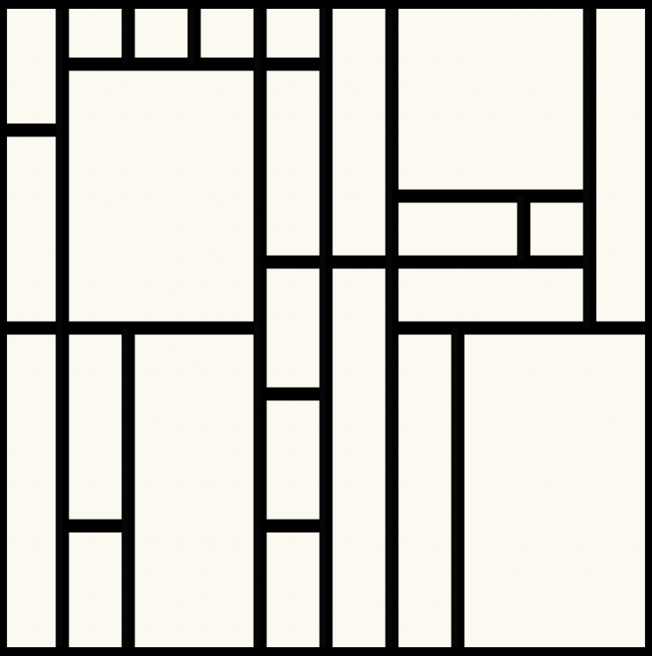

### Splatting
As a final method, I resorted to every computer science theorist's worst nightmare: brute force. I decided I would just "splat" rectangles onto the grid. Then I would evaluate the result to see if it met certain aesthetic criteria of shape, size, and location and accordingly accept it or reject it. I would then continue until the grid filled up. Despite the nearderthalic nature of the approach, I liked it for two main reasons. First, it turns out it was easier to come up with logic to evaluate good rectangles than it was to come up with the logic to cleverly create rectangles. Second, the pure random, chaotic nature of the approach much better captured the organic artsy feel that I had been looking for and missing from the recursive partition approach. The biggest drawback of this approach is that the runtime is pretty high (up to a few seconds) since it has an unbounded iteration amount. Practically though I terminate the algorithm after a while and break up the remaining non-rectangle areas via [largest interior rectangle](https://github.com/OpenStitching/lir) algorithm. Of the approaches though, I found this the most successful for achieving my vision.

## Coloring
Given a set of rectangles in a grid, the next task is to color them in aesthetically.

### Random Coloring
I gave up on this approach pretty quick because I found the results unappealing. I really didn't like how the colors could clump together and it felt too random. One could get away with this approach if the majority of the image was white and only a small number of boxes were colored in. However, I wanted to try and do better than that.

### Graph Coloring
The problem reminded me of the [four color theorem](https://en.wikipedia.org/wiki/Four_color_theorem) I had heard about in math. Essentially, the boxes can represented by a graph with each box being a node and edges drawn between boxes that share a border (corner points don't count). This type of graph is actually a [planar graph](https://en.wikipedia.org/wiki/Planar_graph), and as such, the graph's nodes can be colored with four or less colors such that no two colors share an edge (i.e. no neighboring boxes are the same color). Although not a hard aesthetic rule, avoiding sharing color borders seemed to be a good way to color in the boxes. Lucky for us, we happen to be working with four primary colors (as found in the Mondrian aesthetic)- red, yellow, blue, and white. However, an issue with this is having colors spread out evenly and alternating not to touch each other is a bit too organized. Plus, the paintings typically feature white more than the other colors. There are two solutions I came up to address this. The first is to use "fake" colors (treat the task like a six or seven color problem) with the additional colors later set to white. The second is to use a modified coloring algorithm that weights each node such that the coloring has roughly equal weights. An example of a weight here could be box area, so the coloring would try to cover an equal (or a target proportion of) area with each color. Ultimately, the latter looked a little too organized and often resulted in clumps of color boxes, so the former was chosen.

|maxwidth=500px")

It should be noted that a graph coloring is not unique (most algorithms terminate after finding a feasible coloring). In addition to different colorings, there are also *n!* ways (where *n* is number of real + fake colors) to assign the color labels to the coloring (or *n!/(num_fake)!* unique assignments). Since coloring greatly affects the perception of the art, I went further by iterating through all permutations, quantitatively evaluating each one on how aesthetic it was and keeping the best one. The quantitative evaluation ended up being related to how much the colors border each other (see below for aesthetic guidelines). A minor theoretical issue is the fact that two fake colors are treated as different colors by the algorithm, but for us they are both ultimately white. We would ideally allow color assignments that map to white to share a border if it could lead to some kind of more optimal arrangement of other colors later on. Perhaps instead of a weighted node coloring, we'd want to utilize a weighted edge coloring to describe color interactions. Despite the limitations, I found it practical enough to use. I also sprinkled a little bit of random color flipping to throw some chaos back in the mix after all the algorithmic work.

## Aesthetic Guidelines
I made a lot of fuss about aesthetics, but how would I actually define them? To me, it's kind of like in Severance with the numbers where certain arrangments of boxes and colors can hit you with a really distinctive vibe, and you know a banger (or ugly one) when you see it. After a lot of playing around though, these are the aesthetic guidelines I seemed to have converged to in my tuning:

- Every space must be a rectangle
- The box structure/arrangement should be unbiased
- The box partition design should not be limited to simple recursive structures
- The box aspect ratios should be mostly square-ish with some variation
- There should be elements of randomness in the generation
- Good color distributions minimize the amount that colored boxes touch each other without relying on more relative white coloring. Same color boxes (other than white) should rarely share a border.
- There should not be too many contiguous white boxes
- Images can have large variation in box area within reasonable limits, ideally with at least some large-ish boxes present.
- The number of tiny boxes (e.g. 1 x 1) should be limited
- Only the colors white, red, blue, and yellow are allowed for rectangles. Borders are black

I think my aesthetic goal can be succinctly described as aiming for a sweet spot where the "entropy" of boxes and colors is high but not too high.

## Final Result
Viola! Here are some examples of the final algorithm at different grid sizes.

5x5:
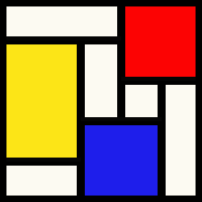
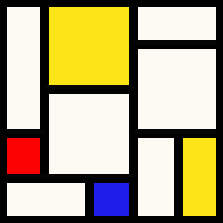
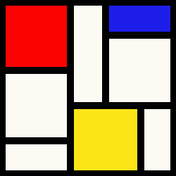

10x10:
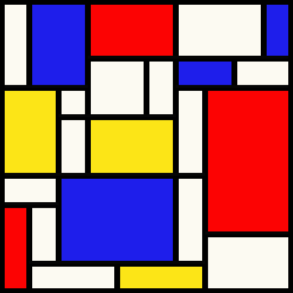
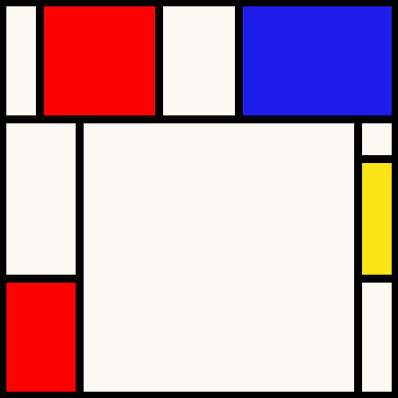
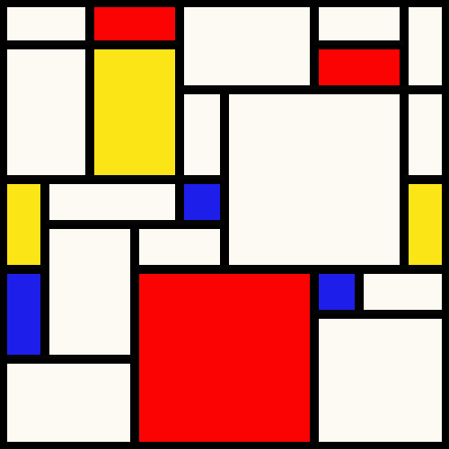

20x20:
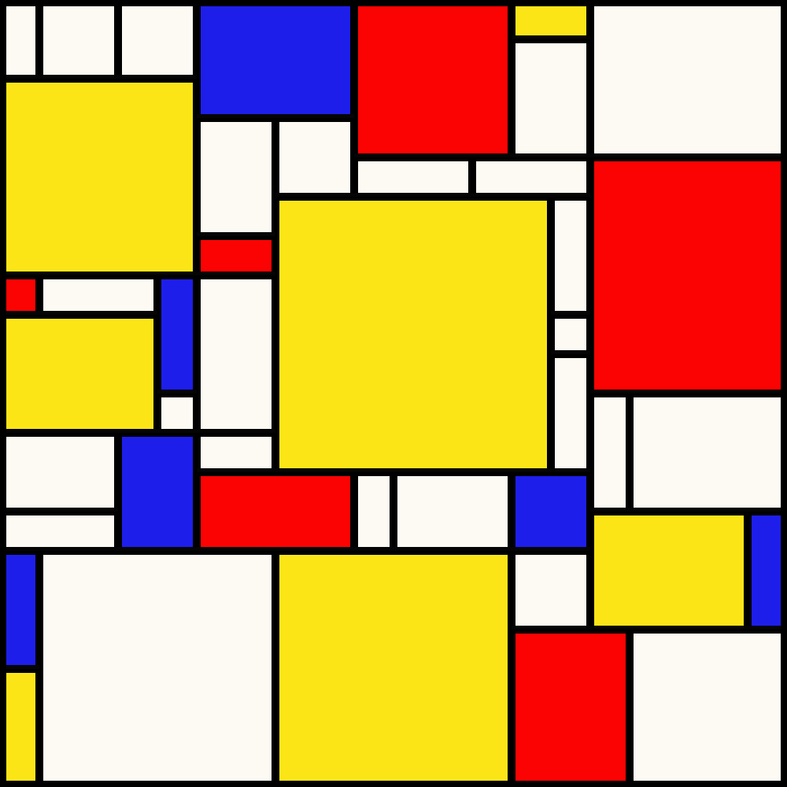
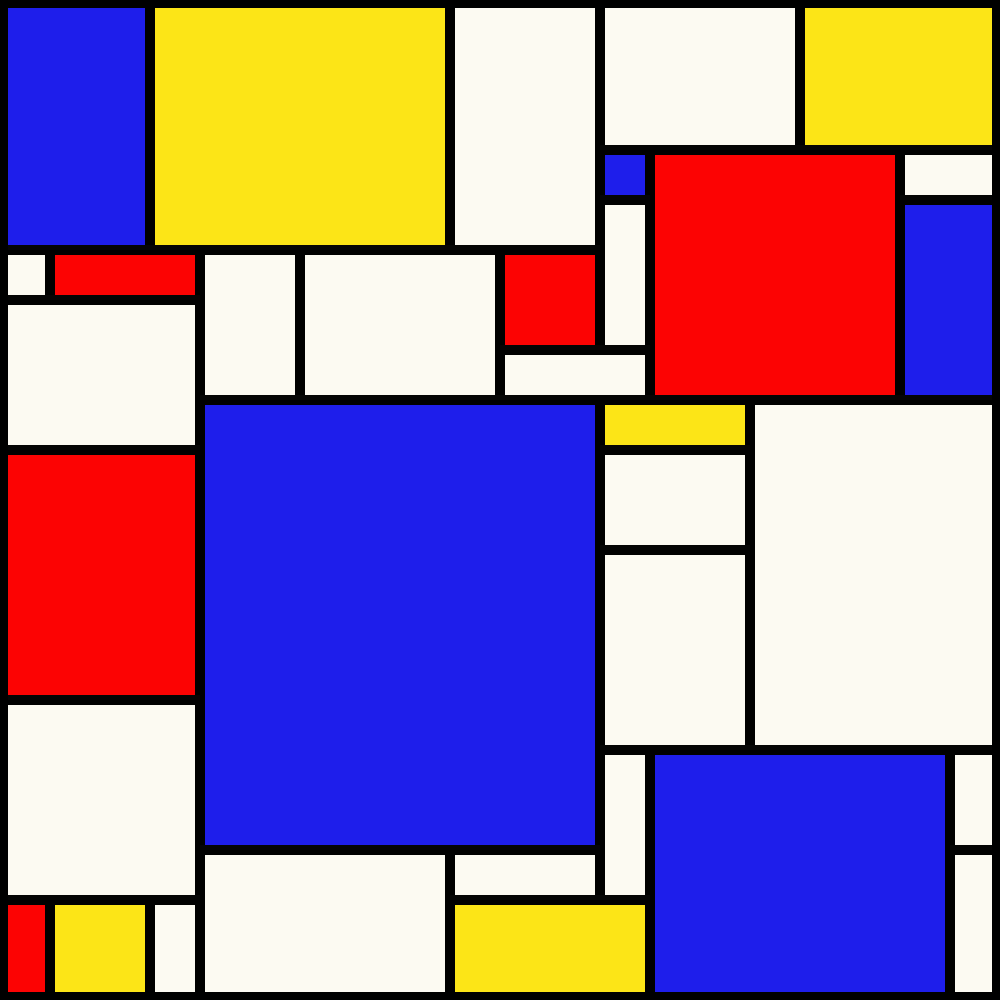
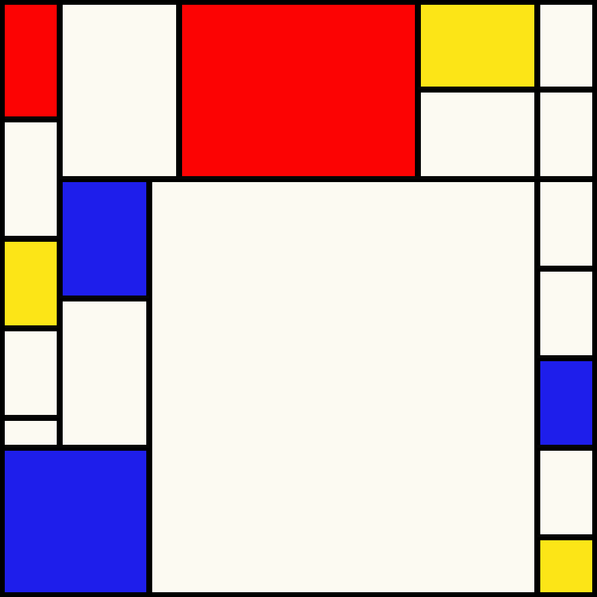

There is definitely room for improvement. Below are some results that I consider unaesthetic.

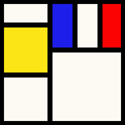
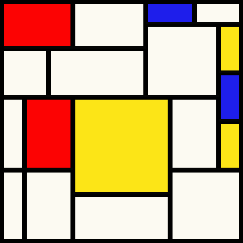
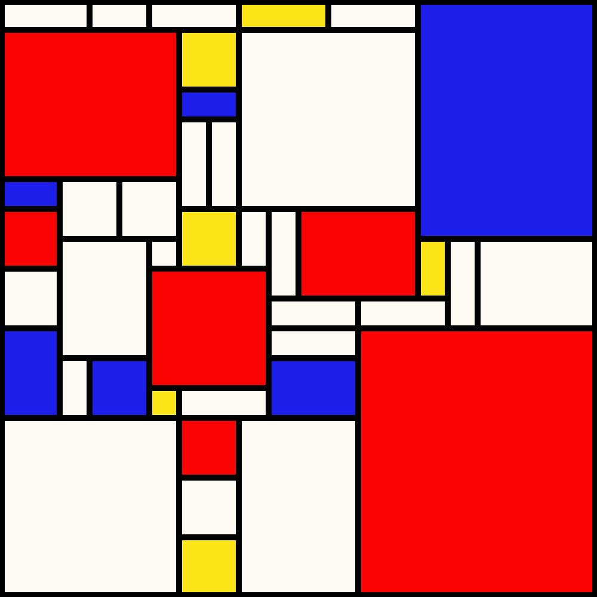

I'm mostly satisfied with the box formation, but the coloring at times can be suboptimal. I sometimes notice images that would be much better if certain box colors were flipped. Then there's also just the random element where not all images are going to be subjectively great. If the algorithm did generate only aesthetic images, I think it would probably be too boring as there wouldn't be much variation. The unaesthetic ones also remind you why the aesthetic ones are so good and make you savor them more. Kinda like what 50 Cent said:
```
Sunny days wouldn't be special if it wasn't for rain
Joy wouldn't feel so good if it wasn't for pain
```
Anyways 😂, I gave it a good go and feel satiated. Maybe I'll come back and try to improve it a bit more. Check out the tool linked at the top to generate your own, and let me know if you enjoy it!