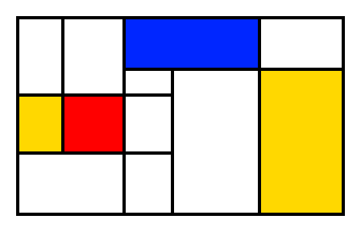

# Making a Mondrian, Old School Generative Art
Tl;dr check out the website to make your own: [makemeamondrian.com](https://www.makemeamondrian.com). Below is a sample final result.

## Background
Several years ago in grad school, I was sitting in a computer vision class as my professor pulled up a slide that caught my attention. In the middle of talking about how [singular value decomposition (SVD)](https://en.wikipedia.org/wiki/Singular_value_decomposition) in linear algebra can solve linear equations, he mentioned off-handedly how SVD could be used to easily compress abstract Mondrian paintings (e.g. ["Tableau I"](https://www.wikiart.org/en/piet-mondrian/tableau-i-1921) or ["Composition A"](https://www.wikiart.org/en/piet-mondrian/composition-a-1923)). Compression by SVD (i.e. low-rank approximation) is pretty well-known (this [blog post](https://zerobone.net/blog/cs/svd-image-compression/) has some good examples), but is not typically used for images much in practice. One of the reasons I believe is that the structure the decomposition produces tends to be axis-aligned (i.e. along rows and columns of the image), whereas natural images have more complex structure. This leads to noticeable degradation fairly quickly, and the artificating at low ranks is seen as horizontal and vertical lines. However, Mondrian's paintings are notably one of the few examples of an *interesting* image that has its structure axis-aligned, and thus is a good candidate for SVD compression.

Since the rank of the approximated paintings could be quite low, it led me to ask the question, "Is it possible to generate other similar Mondrian paintings just by modifying the low rank SVD elements?" In the language of generative AI, I was basically asking if I can treat the singular values/vectors of the truncated decomposition as a *latent space* where I could add some noise and algorithmically pop out another image. After trying it out with some test images, it turned out to be more difficult than I thought. It was unclear how to actually modify the latent space to generate the desired output, especially to follow certain rules of aesthetic I had in mind. Perhaps, it would be an easy task to take a small sample of curated images and train a tiny generative model to learn how the space maps to the desired output. However, given the simplicity of the image, it seemed like overkill and would take the fun out of a good challenge to figure it out myself. Plus, deep down it also felt like there wouldn't be any intrinsic value in the images if I can just crank them out so easily by AI. Almost philosophically, it seems to me that the journey of understanding and the effort of creation would personally give me that satisfaction and value. Thus, I decided to sit down and think about how I would try to create these paintings algorithmically.

**Before I get to the juicy details, I just want to state that the algorithms are tuned to *my* personal notion of aesthetic and what qualifies as good and bad art to which you may disagree. Scroll below for a summary of them.**

There are two main components to create such paintings: box formation and coloring.

## Box Formation
This refers to the task of creating the boxes for the painting. Given a grid size of width x height, we want to partition the space into axis-aligned rectangles aesthetically. Here are some of the ideas I came up with to solve the task.

### Recursive Partition
This is probably most straightforward way to partion a space into rectangles from a computer science perspective. The approach involves drawing a line (or parallel lines) randomly to split a space, and then recursively splitting each of those new spaces. This forms a tree which you keep going down until the heart pleases. There are numerous example implementations of this including [this post](https://fogleman.tumblr.com/post/11959143268/procedurally-generating-images-in-the-style-of), [this post](https://scipython.com/blog/computer-generated-mondrian-art-2/), and [this repo](https://github.com/ronikaufman/mondrian_generator). They aren't bad, but I'm not a big fan of this approach. Most of the examples I see from this feel too organized and inorganic. Coloring choice can help in this regard to feel more like the paintings, but for me having boxes that are perfect subsets of a larger boxes just gives the vibe of a comp sci assignment rather than a work of art.



### Gamified Algorithm
The idea is to seed a distribution of points in the grid, and have an unsupervised learning process play out to carve out boxes following some optimization (each box competing against another). One way this could look is to run a clustering algorithm like [expectation maximization (EM)](https://en.wikipedia.org/wiki/Expectation%E2%80%93maximization_algorithm) to try and have boxes fight like hungry hippos over the random points. Another is making an axis-aligned [Voronoi diagrams](https://en.wikipedia.org/wiki/Voronoi_diagram) that carve out space for clusters of points. Finally, maybe some genetic algorithm akin to playing the game Risk where an initial set of boxes (maybe from recursive partitioning), compete to conquer each other's areas. But wait, wasn't I hating on learning algorithms in the first section? Yes, but to me these feel different primarily because they're unsupervised (no labeled data). Therefore, their learning is more well-understood, there is a lot of manual tuning to adjust to proper aesthetics, and evolution of learning kind of poetically follows the more relatable game theory of life (or maybe it's not that deep and I have particular preferences). Although I liked this line of thinking a lot, I found it difficult to implement. For one, most of the name algorithms don't work well for axis-aligned constraints as well as with something like Gaussian distributions. Second, the point of optimization from each box's perspective is to win, but we wouldn't want scenarios like one box taking over the whole grid. Third, it was challenging to come up with rules on how boxes could expand or boxes could merge while maintaing desired aesthetics. Perhaps I might come back to this approach sometime.

### Tetris blocking
A more fun approach is to treat the problem like a game of tetris. Imagine filling up the grid with random boxes sliding down into the spaces where they can fit until completion. Based on available spaces in a row, we can choose and filter the types of boxes we allow. Although a pretty intuitive approach, I ran into a problem with box biasing. That is, the nature of this method encourages suboptimal box creation since it more or less a greedy algorithm: filling up one side without concern for how the remaining space will look. For example, suppose you have two rectangles that fill the width of a row completely except for one space between them that separates them. The types of rectangles that can fill that space can only be one unit wide, but they can be any unit tall. Thus, there is a biasing towards slender rectangles that fill holes. You can encourage the aspect ratio to be square, but it will typically create a stack of 1 x 1 rectangles which is also typically not as aesthetic. This approach could potentially be adjusted to reduce the odds of those situations, but the logic became too complicated, so I ended up ditching this approach as well.

### Splatting
As a final method, I resorted to every computer science theorist's worst nightmare: brute force. I decided I would just "splat" rectangles onto the grid. Then I would evaluate each new splat to see if it met certain aesthetic criteria of shape, size, and location and accordingly accept it or reject it. I would then continue until the grid filled up. Despite the nearderthalic nature of the approach, I liked it for two main reasons. First, it turns out it was easier to come up with logic to evaluate good rectangles than it was to come up with the logic to cleverly create rectangles. Second, the pure random, chaotic nature of the approach much better captured the organic artsy feel that I had been looking for and missing from the recursive partition approach. The biggest drawback of this approach is that the runtime is pretty high (up to a few seconds) since it has an unbounded iteration amount. Practically though I terminate the algorithm after a while and break up the remaining non-rectangle areas via [largest interior rectangle](https://github.com/OpenStitching/lir) algorithm. Of the approaches though, this was by and large the most successful for achieving my vision.

## Coloring
Given a set of rectangles in a grid, the next task is to color them aesthetically.

### Random Coloring
I gave up on this approach pretty quick because I found the results atrocious. I really didn't like how the colors could clump together. One could get away with this approach if the majority of the image was white and only a small number of boxes were colored in. However, I wanted to try and do better than that for the images I wanted.

### Graph Coloring
The problem reminded me of the [four color theorem](https://en.wikipedia.org/wiki/Four_color_theorem) I had heard about in math. Essentially, the boxes can be turned into a graph with each box being a node and edges are drawn between boxes that share a border (corner points don't count). This type of graph is actually a [planar graph](https://en.wikipedia.org/wiki/Planar_graph), and as such, the graph's nodes can be colored with four or less colors such that no two colors share an edge (i.e. no neighboring boxes are the same color). Although not a hard aesthetic rule, avoiding sharing color borders seemed to be a good way to color in a graph. Just our luck, we happen to have four primary colors (as found in the Mondrian aesthetic)- red, yellow, blue, and white. However, an issue with this is having colors spread out evenly and alternating not to touch each other is a bit too organized. Plus, the paintings typically feature white more than the other colors. There are two solutions I came up with. The first is to use "fake" colors (treat it like a six or color color problem) with the additional colors set to white. The second is to use a modified coloring algorithm that weights each node such that the coloring has roughly equal weights. An example of weight here would be box area, so the coloring would try to cover equal area with each color. Ultimately, the latter looked a little too organized, so the former was chosen.

It should be noted that this graph coloring is not unique (most algorithms terminate after finding a feasible one). In addition to different colorings, there are also *n!* ways (where *n* is number of real + fake colors) to assign the actual colors to the coloring. Since coloring greatly affects the perception of the art, I went further by iterating through all permutations, quantitatively evaluating each one on how aesthetic it was and keeping the best one. The quantitative evaluation ended up being related to how much the colors border each other (see below for aesthetic guides). A minor theoretical issue is the fact that two fake colors are treated as different colors by the algorithm, but for us they are both ultimately white. We would ideally allow white of the same "color" to share a border if it could lead to some kind of more optimal arrangement of the other colors later on. Perhaps instead of an equal node weighting, we'd want to describe an equal edge weighting for color interactions. Despite the limitations, I found it practical enough to use. The cherry on top was adding a little bit of random color flipping to throw some chaos back in the mix after all the algorithmic work.

## Aesthetic Guides
I made a lot of fuss about "aesthetics", but what are they actually? After a lot of playing around, these are the aesthetic rules I seemed to have converged to, guiding my tuning:

- The box partition structure should not be describable by a tree (i.e. hierarchical structure)
- The box aspect ratios should be mostly square-ish with some variation
- There should be elements of randomness in the approach, i.e. it should not look too planned/neat/organized.
- Good color distributions minimize the amount colored boxes touch each other without relying on more relative white coloring. Same color boxes (other than white) should rarely share a border.
- There should not be too many contiguous white boxes
- Images can have large variation in box size within reasonable limits. There should be at least one large-ish box in the image.
- The number of very tiny boxes (e.g. 1 x 1) should be limited

## Final Result
Viola! Here's a sample of the final results. I tried them out from size 5 x 5 to 20 x 20. The smaller ones are easier to make, while the larger ones required more tuning to guide it.

There is some room for improvement. I feel probably 90% satisfied with the box formation and 70% with the coloring. The algorithm can generate what I deem to be unaesthetic images, but I kinda like that. If it did generate only aesthetic ones, I think it would probably be too boring as there wouldn't be much variation. They also remind you why the aesthetic ones are so good and make you savor them more. Kinda like what 50 Cent said:
```
Sunny days wouldn't be special if it wasn't for rain
Joy wouldn't feel so good if it wasn't for pain
```
Anyways 😂, I gave it a good go and feel satiated. Check out the tool linked at the top to generate your own, and let me know if you enjoy it!